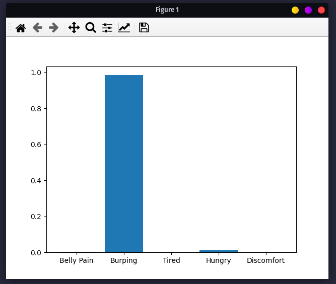

# Baby Translator
Did you know there are several types of baby cries? Crying of the baby may change depending on the situation. The power of AI can be used to decode the cry of a baby and figure.

This is a basic classification model built using the [YAMNet](https://tfhub.dev/google/yamnet/1) embeddings to classify crying baby sound into 5 categories.

Here is the result from running `python test.py`, which uses the pretrained model from the `./model` directory to decode the crying sound from the `test.wav` file.  

## Training a new model
`train.py` can be used to train a new model. The model would give better results if trained with more data.

All data to train the current model are taken from https://github.com/gveres/donateacry-corpus
